# CANSAT-CAD-Repository
Mechanical design repository for a competitive CANSAT developed for international aerospace engineering competitions. This project focuses on lightweight structural design, deployable mechanisms, and subsystem integration under strict dimensional and mass constraints.

The repository includes CAD models, structural assemblies, manufacturing-oriented designs, and engineering iterations developed using SolidWorks. The system was optimized for reduced weight, manufacturability, and reliable deployment performance during launch and landing conditions.

Key features:
- Lightweight aerospace-inspired structural design
- Deployable fin and payload mechanisms (autogyro system)
- The materials used are wood and ABS and Hyper PLA filament for 3D printing. These are the only materials permitted for the competition according to the rules.
- CAD assemblies and subsystem integration
- Design for additive manufacturing
- Mechanical optimization under competition constraints
- Engineering documentation and renders

Tools used:
- SolidWorks
- Additive Manufacturing 3D printing
- SolidWorks Simulation
- Laser cutting
---
## General model
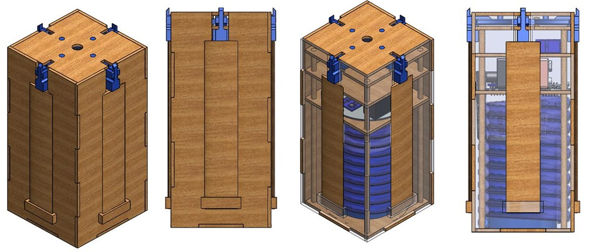

## Programa Espacial Universitario UNAM Mundial CANSAT 2025.
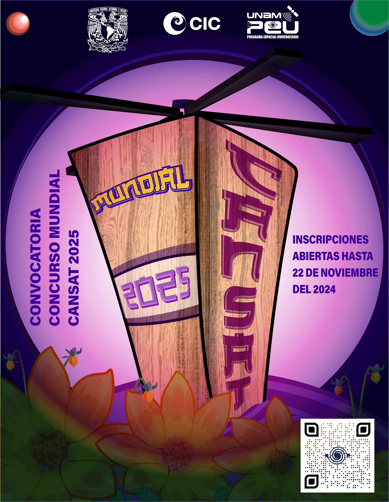

# Project Overview
This project was developed for the PEU World CanSat 2025 Competition organized by the Programa Espacial Universitario (PEU) of the National Autonomous University of Mexico (UNAM).

The mission simulated the development of a real aerospace system under strict engineering, dimensional, and operational constraints. The CanSat platform was designed to emulate a satellite deployment mission focused on atmospheric data acquisition, controlled descent, and payload protection during landing operations.

The system was required to transmit telemetry data throughout the mission, including pressure, temperature, acceleration, velocity, and carbon dioxide concentration during ascent and descent phases.

The satellite was released from an altitude of approximately 300–400 meters using a drone-based deployment system and had to achieve a safe landing while preserving the integrity of all onboard payloads.

The mission payload included:
- A raw egg representing a biological payload
- Endemic seeds
- A water container
- Environmental sensing systems
- Wireless telemetry transmission

The mechanical subsystem focused on lightweight structural optimization, subsystem integration, impact resistance, deployable autogyro implementation, and manufacturability under competition constraints.

# Design Requirements

The CanSat mechanical and electronic architecture was developed according to the official PEU World CanSat 2025 mission requirements.

Key engineering constraints included:

- Maximum total mass below 700 g including payload
- 2U CubeSat-equivalent form factor
- Internal integration of all electronic systems and telemetry components
- Structural resistance against landing impact
- Protection of onboard biological payloads and water container
- Autonomous passive descent using an internal autogyro system
- Continuous telemetry transmission during flight and for at least 30 seconds after landing
- Center of mass restrictions for stable descent behavior
- Compatibility with drone-assisted deployment at 300–400 m altitude
- Rapid payload integration during launch-day operations

The structure was designed with emphasis on:
- Lightweight construction
- Additive manufacturing compatibility
- Mechanical robustness
- Reliable subsystem packaging
- Aerodynamic stability during descent
- Efficient internal volume utilization

The final design balanced manufacturability, structural rigidity, payload survivability, and mission reliability within highly constrained aerospace competition conditions.

# CAD Development
In the first stage of the project, an initial solution concept was developed. For this purpose, springs were proposed as a damping system, along with a storage capsule for both the egg and the water. However, this solution was not optimal because the electronics system and the autorotation system could not fit within the specified dimensions.

  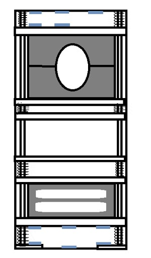

First concept.

## Deployable Mechanism
The deployment mechanism used in this project consists of an autorotation system. Its purpose is to decelerate the fall of the CanSat by acting as a passive descent system. Instead of using a conventional parachute, it employs a free-spinning rotor. During descent, the airflow forces the blades to rotate (autorotation), generating drag and lift, which enables a controlled, safe, and precise landing of the device.

This image presents the initial prototype of the CanSat and the autorotation system during the deployment phase. The following section aims to show the mechanism and the deployment sequence of the passive deceleration system in greater detail.

  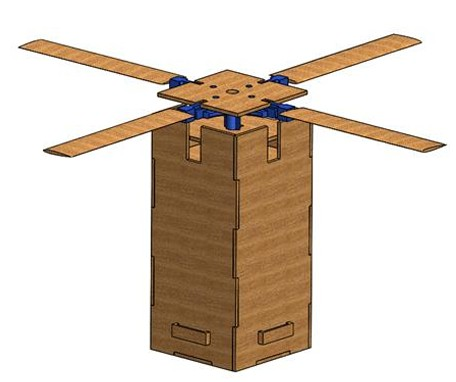

CanSat with Autorotation System Deployment.

In this sequence, it can be observed that the deployment system is composed of a shaft (manufactured using 3D printing) which, in its retracted position, is held in place by an SG90 servomotor. When the CanSat computer, together with the barometer, detects an altitude of 100 m, the servomotor is activated and releases the shaft, causing the compression spring to expand and deploy the autorotation system.

  

Side View of the Deployment System Sequence.

The deployment sequence of the autorotation system can be observed at each stage: when the spring is fully compressed, when the spring pushes the system shaft, and finally when the shaft is completely released.

To ensure that the shaft does not experience unintended displacement or rotations caused by vibrations, lateral rails were designed on the shaft and integrated with the levels and structure of the CanSat, ensuring the proper deployment of the autorotation system.

  

Frontal View of the Deployment System Sequence

### Components
The components that make up the autorotation system consist of a main disc to which a high-speed bearing is coupled. Together with the shaft, these are the main elements responsible for providing rotational movement. Additionally, the joints responsible for holding the airfoil profiles were designed. These components were manufactured using additive manufacturing (3D printing).

  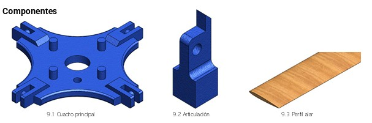

Componentes 1

  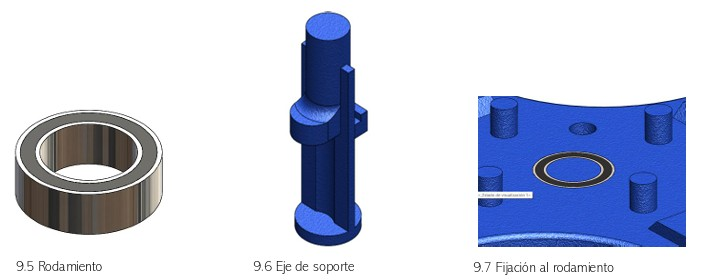

Componentes 2

### Drawings and dimensions
This drawing shows the dimensions of the CanSat when the autorotation system is deployed. During the course of the competition, these drawings were developed to ensure that the device complied with the dimensional restrictions.

  

Dimensions of the CanSat with the Autorotation System Deployed

  

Dimensions of the Autorotation System

This drawing shows the dimensions of the deployment system, as well as the configuration of the servomotor, the shaft, and the disc.

  

Dimensions and Configuration of the Deployment Mechanism

## External structure
## External Structure Evolution
The initial structural concept utilized a compact fixed-body configuration designed primarily for subsystem protection and internal packaging. However, as the project evolved, the integration of the passive autogyro descent system introduced major spatial and mechanical challenges associated with storing the airfoil profiles within the maximum allowable CanSat dimensions.

  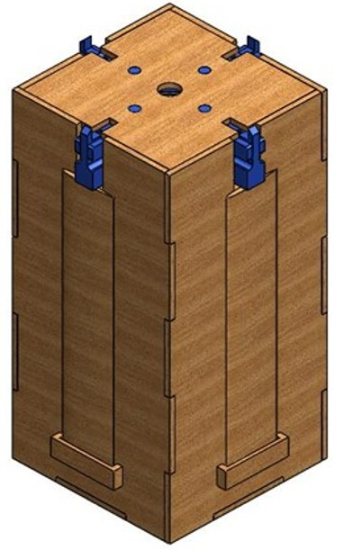

First concept external structure.

The external structure evolved significantly throughout the development process in order to satisfy the dimensional constraints established by the PEU World CanSat 2025 competition while maintaining a lightweight and manufacturable architecture.

To address these constraints, the final structural design implemented a deployable external architecture that allowed the airfoil profiles to remain folded during launch and deployment operations. This solution enabled compliance with competition dimensional regulations while significantly improving aerodynamic deployment capabilities during descent.

Additionally, the redesign focused heavily on mass reduction through:
- Lightweight panel optimization
- Reduced material usage
- Simplified mechanical interfaces
- Additive manufacturing-oriented components

The resulting structure achieved a balance between:
- Mechanical rigidity
- Aerodynamic functionality
- Manufacturability
- Internal subsystem integration
- Competition compliance

while maintaining a final system mass below the competition threshold.
<table align="center">
  <tr>
    <td align="center">
      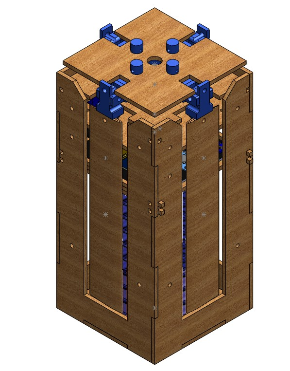 
      <b>Main Assembly</b>
    </td>
    <td align="center">
      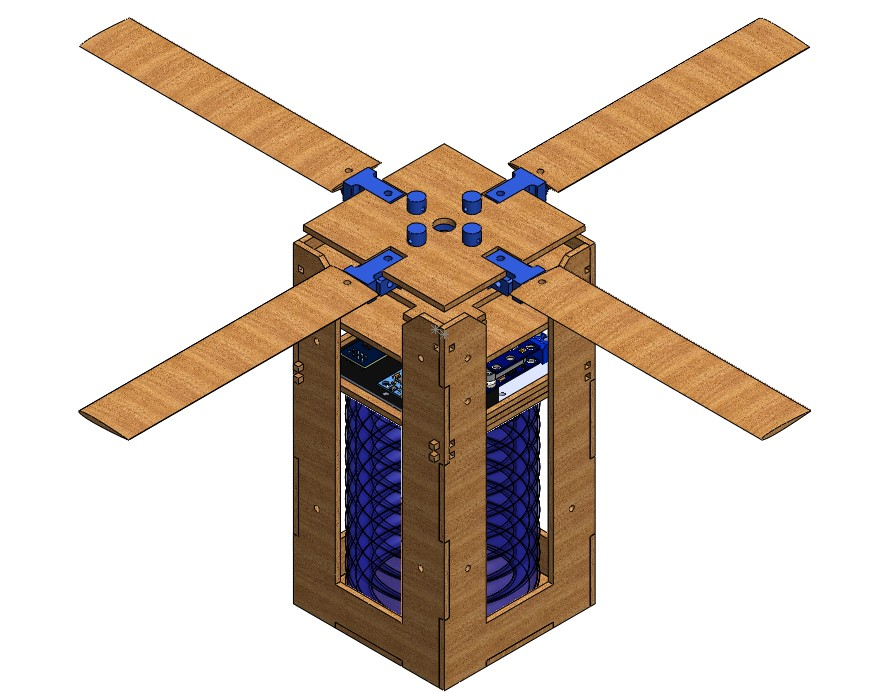 
      <b>Deployment Mechanism</b>
    </td>
  </tr>
</table>

## Internal structure
The internal architecture of the CanSat underwent multiple design iterations focused on improving subsystem integration, manufacturability, and structural efficiency while minimizing overall system mass.

  

First internal configuration. 

The initial internal structure utilized a traditional multi-platform configuration supported by vertical rods and fixed mounting interfaces. While this approach provided adequate structural support during early development stages, it introduced additional material usage, increased assembly complexity, and limited accessibility during subsystem integration.

As the design evolved, the internal structure was redesigned using integrated rail-based supports directly embedded into the external panels. This new configuration allowed the internal electronic floors to be installed and removed through a simple sliding mechanism, significantly simplifying assembly operations and maintenance procedures.

To implement this solution, precision mounting holes and lightweight guide rails were incorporated into the structural side panels. This redesign reduced the need for additional support hardware and minimized the quantity of internal structural members.

The updated architecture provided several engineering advantages:
- Reduced structural mass
- Simplified subsystem installation
- Improved manufacturability
- Increased internal accessibility
- Reduced part count
- Enhanced structural organization

Additionally, the redesign optimized the internal volume distribution to accommodate:
- Telemetry electronics
- Power systems
- Sensor modules
- Payload protection components
- The deployable autogyro mechanism

The final internal structure achieved a balance between lightweight construction, modular integration, and mechanical rigidity while maintaining compliance with competition dimensional constraints.

  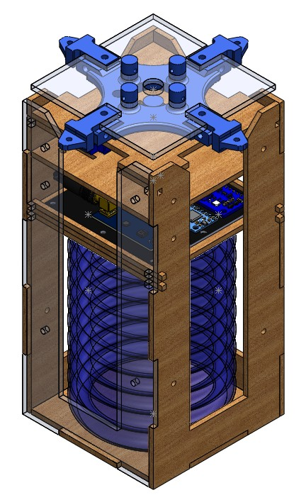

Final intern structure.

## Water and seeds container
The seed and water payload containers were designed according to the storage capacities established in the PEU World CanSat 2025 competition requirements. The mission constraints required the system to transport:
- 15 cm³ of endemic seeds
- 100 mL of water

For the seed payload, a 20 cm³ threaded aluminum container was selected due to its lightweight properties, manufacturability, and impact resistance characteristics. One of the main advantages of this material selection was the ductility and deformation capability provided by the aluminum structure.During the competition landing sequence, the container experienced visible plastic deformation as a result of the impact forces generated during touchdown. However, despite the structural deformation, the threaded sealing system successfully prevented seed leakage, preserving payload integrity throughout the mission.

This result validated the container selection strategy by demonstrating an effective balance between:
- Lightweight construction
- Mechanical resilience
- Payload protection
- Manufacturability
- Reliable sealing performance under landing impact conditions

<table align="center">
  <tr>
    <td align="center">
      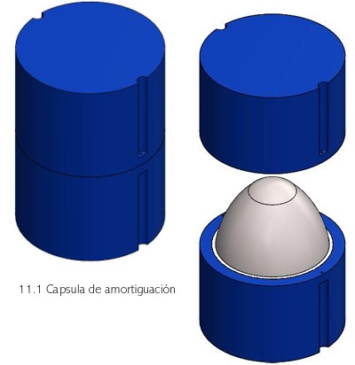 
      <b>Egg container</b>
    </td>
    <td align="center">
      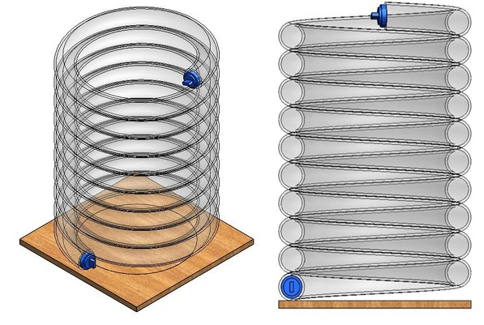 
      <b>Water container</b>
    </td>
  </tr>
</table>
The water payload container was developed to satisfy the competition requirement of transporting 100 mL of water while simultaneously contributing to the impact protection strategy of the biological payload.

A transparent 3/8" PVC hose was selected as the primary containment element due to its flexibility, lightweight characteristics, and ease of integration within the constrained internal volume of the CanSat.

To determine the required hose length, the internal volume was calculated as a function of the hose diameter in order to obtain the necessary capacity for storing the mandated 100 mL of water payload. Once the required length was determined, the hose was coiled around the internal structure of the CanSat.

This configuration provided multiple engineering advantages:
- Efficient internal volume utilization
- Lightweight water storage solution
- Simplified manufacturability
- Flexible subsystem integration

Additionally, the coiled hose configuration functioned as a passive impact absorption system surrounding the egg payload. During landing, the flexible PVC structure helped dissipate part of the impact energy, contributing both as:
- The water storage system
- A protective damping mechanism for the biological payload

This multifunctional design approach improved payload survivability while minimizing the need for additional protective structures and reducing overall system mass.

## System Integration
The final CanSat configuration represents the integration of multiple mechanical, electronic, and payload subsystems developed under strict dimensional, mass, and operational constraints established by the PEU World CanSat 2025 competition.

A major focus of the integration process was the implementation of the passive autogyro descent mechanism within the limited internal volume of the CanSat platform. The deployable airfoil system was successfully integrated into the redesigned external structure, allowing the rotor blades to remain fully contained during launch operations while enabling reliable deployment during descent.

To support this mechanism, both the internal and external structures underwent significant redesign iterations focused on:
- Lightweight optimization
- Internal volume efficiency
- Structural rigidity
- Manufacturability
- Deployment reliability

The updated external architecture incorporated integrated guide systems and deployable supports for the autogyro mechanism, while the redesigned internal structure implemented modular sliding rails for simplified subsystem installation and maintenance.

The electronic subsystem integration included:
- Telemetry transmission systems
- Environmental sensing modules
- Power distribution components
- Microcontroller-based control systems
- Payload monitoring electronics

Special attention was dedicated to internal subsystem organization in order to optimize wiring distribution, center of mass positioning, and accessibility during assembly operations.

Additionally, the payload containers for both the water and seed storage systems were integrated as multifunctional structural elements within the CanSat architecture. The coiled PVC water container contributed as both:
- The required water payload storage system
- A passive damping mechanism for egg protection during landing

while the aluminum seed container provided lightweight and impact-resistant payload protection under landing conditions.

The final integrated system achieved a balance between:
- Mechanical performance
- Payload survivability
- Structural efficiency
- Aerodynamic deployment capability
- Manufacturability
- Competition compliance

Resulting in a fully functional aerospace platform capable of completing the mission requirements under real operational conditions.

Plane 1

  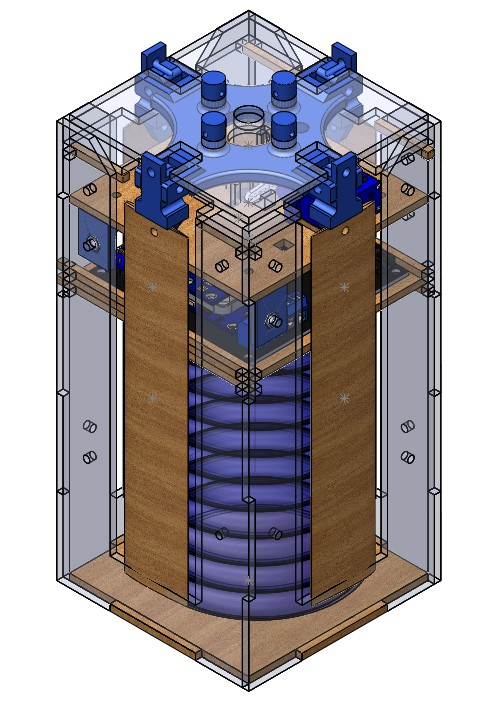

# Manufacturing Process

  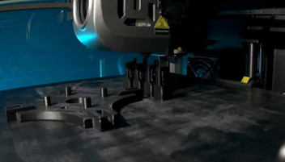

Manufacturing autorotation components.

  

Manufacturing first external structure concept.

 

